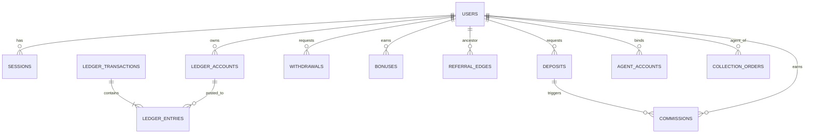

# Zee9 Platform — Backend Architecture & Build Plan

**Status:** Draft v1 · **Owner:** Zee9 team · **Scope of this phase:** user registration, wallet, deposit, withdraw, referral, agent (C2C) panel, admin panel. Game engines are deliberately out of scope for now (planned later).

> Decisions locked for this plan: **Node.js + TypeScript (Express.js + Prisma)**, **PostgreSQL + Redis + BullMQ**, **phone + password auth**, **single containerized VPS (Docker Compose)** at launch, scaling out later.

---

## 1. Goals & non‑goals

**Goals**
- One backend that serves three frontends: the **Player games app** (`/`), the **C2C Agent panel** (`c2c-panel/`), and the **Admin console** (`admin-panel/`).
- Correct, auditable **money handling** (wallet, deposit, withdraw, referral commission, bonuses) that stays correct under concurrency as user count grows.
- Everything the admin panel currently mocks becomes **real, persisted, configurable** data.
- Secure by default (authn/authz, rate limiting, audit trail, withdrawal review).
- Operable by a small team on a single VPS, with a clear path to horizontal scale.

**Non‑goals (for now)**
- In‑house game RNG / game rounds engine (Aviator, Wingo, etc.) — later, as a separate **Remote Game Server (RGS)**.
- Native mobile apps.
- Real payment‑gateway certification — we model deposit/withdraw as **manual + agent‑assisted** first (matches the current C2C flow), with a gateway adapter interface ready to plug in.

---

## 2. High‑level architecture

```
                         ┌───────────────────────────────┐
   Player app  ─────────▶│                               │
   (React/Vite)          │      Nginx (TLS, reverse       │
                         │      proxy, rate‑limit)        │
   Agent panel ─────────▶│                               │
   (c2c-panel)           └──────────────┬────────────────┘
                                        │
   Admin panel ─────────▶               │  HTTPS / WSS
   (admin-panel)                        ▼
                         ┌───────────────────────────────┐
                         │   API (Express.js, stateless)  │   ── REST /api/v1 + WebSocket
                         │   RBAC middleware per role     │
                         └───┬───────────────┬────────────┘
                             │               │
                   Prisma    │               │ BullMQ (enqueue)
                             ▼               ▼
                   ┌──────────────┐   ┌──────────────┐
                   │ PostgreSQL   │   │   Redis      │  cache, sessions blacklist,
                   │ (source of   │   │              │  rate‑limit, queues, ws pub/sub
                   │  truth,      │   └──────┬───────┘
                   │  ledger)     │          │
                   └──────────────┘          ▼
                                     ┌──────────────┐
                                     │ Worker        │  BullMQ consumers:
                                     │ (Node.js)     │  commission, bonuses,
                                     └──────────────┘  notifications, reconcile
```

- **API** and **Worker** are the same codebase, started in two modes. The API never does heavy/slow work inline — it enqueues jobs.
- **PostgreSQL is the single source of truth** for money. Redis is a cache/coordination layer only; losing Redis must never lose money.
- **Stateless API** (JWT, no in‑process session) so we can run N instances behind Nginx later.

### Monolith‑first, modular
Start as a **modular monolith** (one deployable, clean module boundaries). Do **not** start with microservices — it multiplies ops cost with no benefit at this size. The module boundaries below are drawn so any module can later be extracted if a specific part needs independent scaling.

---

## 3. Tech stack & rationale

| Concern | Choice | Why |
|---|---|---|
| Language | **TypeScript** | Same language as the React frontends → shared types, one skillset. |
| Framework | **Express.js** | Minimal, ubiquitous, huge middleware ecosystem, easy to hire for. We impose structure ourselves (see below) so it stays maintainable for a money app. |
| ORM / migrations | **Prisma** | Type‑safe queries, great migration workflow, generates types shared with API. |
| Database | **PostgreSQL 16** | ACID transactions, `SELECT … FOR UPDATE`, `SERIALIZABLE`, `NUMERIC`, partial indexes, partitioning — the right tool for a ledger. Chosen over MySQL for stronger transactional/ledger guarantees. |
| Cache / coordination | **Redis 7** | Rate limiting, hot config cache, WS pub/sub, BullMQ backend. |
| Jobs / queues | **BullMQ** | Reliable delayed/retryable jobs on Redis (commission, bonus expiry, notifications). |
| Realtime | **Socket.IO** (Redis adapter) | Push new collection orders to agents, balance updates to players. |
| Validation | **zod** schemas (validate middleware) | Reject bad input at the edge; infer TS types from schemas. |
| Auth | **JWT access + rotating refresh**, **Argon2id** hashing | Stateless, standard, secure. |
| Money type | **BIGINT minor units (paisa)** | No floating‑point money, ever. `100.00 PKR` = `10000`. |
| File uploads | **multer** → VPS volume (served read‑only via Nginx), or S3/Backblaze | Deposit receipts & payout proofs. Validate mime/size, randomized filenames, no execution. Swap to object storage when it grows. |
| Logging | **pino** | Fast structured logs. |
| Errors | **Sentry** | Exception tracking. |
| Testing | **Jest + Supertest**, **Testcontainers** | Unit + API + real‑DB integration tests, especially for wallet math. |

### Imposing structure on Express (important)
Express is unopinionated, so we enforce a **layered architecture** to keep a money app maintainable — controllers stay thin, all money logic lives in services:

```
apps/api/src/
├─ modules/
│  ├─ auth/         auth.routes.ts · auth.controller.ts · auth.service.ts · auth.schema.ts
│  ├─ wallet/       (routes → controller → service → prisma)
│  ├─ deposits/  withdrawals/  referrals/  agents/  admin/  bonuses/  wheel/ …
├─ middleware/      authenticate.ts · authorize(role) · validate(zodSchema) · idempotency.ts · rateLimit.ts · errorHandler.ts
├─ lib/             prisma.ts · redis.ts · queue.ts · logger.ts · money.ts · jwt.ts
├─ core/            LedgerService (the only money‑mover), config loader, error types
└─ app.ts / server.ts
```

- **Routing:** one `Router` per module, mounted under `/api/v1`.
- **Layers:** `route → validate(zod) → authenticate → authorize(role) → controller → service → prisma`. Controllers never touch the DB directly; services never read `req`/`res`.
- **RBAC:** `authorize('ADMIN')` / `authorize('AGENT')` middleware instead of framework guards.
- **Errors:** a central `errorHandler` maps typed `AppError`s to the standard JSON error envelope; async handlers wrapped so rejections don't crash the process.
- **DI:** lightweight — services are plain modules/classes instantiated once (no heavy DI container needed).

---

## 4. Data model

Money is stored as **BIGINT paisa**. Every balance‑changing operation is a **double‑entry ledger transaction** (sum of debits = sum of credits). Wallet balances are a **materialized cache** kept in sync inside the same DB transaction and independently verifiable by summing ledger entries.

### 4.1 Core tables (summary)

**Identity & access**
- `users` — `id, phone (unique), password_hash, role (PLAYER|AGENT|ADMIN), status (ACTIVE|BANNED|PENDING), display_name, vip_level, referral_code (unique), referred_by (users.id, nullable), created_at`
- `admin_profiles` / `agent_profiles` — role‑specific fields (agent: agentship_active, wallets_filled; admin: permission_scope).
- `sessions` — `id, user_id, refresh_token_hash, device, ip, user_agent, expires_at, revoked_at` (refresh‑token rotation + reuse detection).
- `password_resets` — OTP‑based reset later.

**Money (ledger core)**
- `ledger_accounts` — one per (owner, bucket). Buckets: `MAIN`, `BONUS`, `FROZEN`, `COMMISSION`. Plus **system accounts**: `HOUSE`, `BONUS_POOL`, `GATEWAY_CLEARING`, `AGENT_FLOAT`. Columns: `id, owner_user_id (nullable for system), bucket, currency, balance (bigint), updated_at`.
- `ledger_transactions` — `id, type, status (POSTED|VOID), idempotency_key (unique), reference_type, reference_id, created_by, created_at, meta jsonb`.
- `ledger_entries` — `id, transaction_id, account_id, direction (DEBIT|CREDIT), amount (bigint)`. **Invariant enforced in code + a DB check job:** per transaction, `Σ debit = Σ credit`.

> Balances are never mutated by ad‑hoc `UPDATE balance = balance + x` from random code paths. All mutations go through a single **`LedgerService.post(tx)`** that (a) opens a DB transaction, (b) `SELECT … FOR UPDATE` on affected accounts, (c) writes entries, (d) updates cached balances, (e) commits. This is the only way money moves.

**Payment channels (admin‑managed deposit accounts)**
- `payment_channels` — the platform's own accounts that players pay **into** for manual deposits: `id, method (JAZZCASH|EASYPAISA|BANK), account_number, account_title, bank_name (nullable), instructions, enabled, min_amount, max_amount, priority, created_at`. Admin adds/rotates these from the panel; the player app lists only **enabled** channels for the chosen method.

**Deposits / withdrawals (manual at launch)**
- `deposits` — `id, user_id, amount, method (JAZZCASH|EASYPAISA|BANK), channel_id (which account they paid into), sender_account (nullable), trx_id, receipt_url, status (PENDING|APPROVED|REJECTED), agent_id (nullable, if agent‑assisted), reject_reason, idempotency_key, created_at, processed_by, processed_at`.
- `withdrawals` — `id, user_id, amount, method, account_details jsonb (payee number/title/bank), status (PENDING|APPROVED|REJECTED|PAID), agent_id, trx_id (filled on payout), payout_proof_url, wager_ok (bool snapshot), reject_reason, created_at, processed_by, processed_at`.
- `media` — uploaded files (deposit receipts, payout proofs): `id, owner_user_id, kind (DEPOSIT_RECEIPT|PAYOUT_PROOF), url, mime, size, created_at`. Validated for type/size; scanned; served read‑only.

**Agent / C2C**
- `agent_accounts` — bound payout accounts (`user_id (agent), method, number, holder, enabled, awaiting_review`).
- `collection_orders` — the C2C order lifecycle: `id, order_no (unique), type (DEPOSIT|WITHDRAW), amount, reward, player_id, agent_id, wallet_account, collection_account, method, status (PENDING|CHECKING|PROCESSING|SUCCESS|FAIL), frozen_amount, created_at, resolved_at`.
- `agent_wallets_progress` — tracks the “5 wallets × ₹1000” activation rule.

**Referral & commission**
- Referral tree is derived from `users.referred_by`; we also keep a denormalized `referral_edges (ancestor_id, descendant_id, level 1..3)` for fast 3‑level lookups.
- `commissions` — `id, agent_id, source_user_id, source_deposit_id, level (1|2|3), rate_bps, amount, status (ACCRUED|PAID|VOID), created_at`. (`rate_bps` = basis points, e.g. 30% = 3000.)

**Bonuses & engagement**
- `bonuses` — `id, user_id, type (REGISTRATION|DAILY_OPEN|DEPOSIT_1|DEPOSIT_2|DEPOSIT_3|DAILY_DEPOSIT|REBET|CASHBACK|WHEEL), amount, wager_required (bigint), wager_progress (bigint), status (LOCKED|ACTIVE|RELEASED|EXPIRED), expires_at, created_at`.
- `wheel_spins` — `id, user_id, wheel (SPIN|DEPOSIT), prize_id, amount, is_physical, created_at` (server‑authoritative outcome).
- `cashback_tiers`, `offers`, `wheel_prizes`, `games` — the admin‑configurable catalogs currently mocked in `admin-panel/`.

**Platform config & audit**
- `settings` — typed key/value (or one JSONB row per group), all editable from the admin panel: registration bonus, daily‑open bonus, deposit‑bonus %s, **commission config** (`commissionEnabled`, `commissionBasis`, `commissionBase`, `commissionLevels`, `commissionL1/L2/L3`, `minDepositToQualify`), agentship rule (`walletsRequired`, `minPerWallet`), min/max deposit & withdraw, wager multipliers, enabled methods, WhatsApp CS number, share/panel link, UI placement flags. Cached in Redis; invalidated on write; every change audited.
- `audit_logs` — `id, actor_id, action, entity_type, entity_id, before jsonb, after jsonb, ip, created_at` (every admin/agent mutation).

### 4.2 ER overview (Mermaid)



---

## 5. Money‑safety principles (read this before writing wallet code)

1. **Postgres is the only source of truth.** Redis/queues can be rebuilt; money cannot.
2. **Double‑entry only.** No balance changes outside `LedgerService.post()`. Every movement has a matching counter‑account (player MAIN ↔ HOUSE / GATEWAY_CLEARING / BONUS_POOL).
3. **Integers, not floats.** Store paisa as BIGINT. Format to decimals only at the API edge.
4. **Row‑lock + serialize per account.** Use `SELECT … FOR UPDATE` (or `SERIALIZABLE` for multi‑account) so concurrent deposits/withdraws can’t double‑spend.
5. **Idempotency keys** on every externally‑triggered money op (deposit confirm, withdraw submit, commission accrual). Re‑delivery must be a no‑op, not a double credit.
6. **State machines, not booleans.** Deposits/withdrawals/orders move through explicit statuses; illegal transitions are rejected.
7. **Wager gating on withdrawal.** A withdrawal checks that bonus/deposit wagering requirements are satisfied at submit time and snapshots the result.
8. **Everything money‑touching is audited** (`audit_logs`) and reconciled by a nightly job that asserts `Σ ledger_entries per account == cached balance` and `Σ all system+user balances == 0` (closed system).

---

## 6. Key flows

**Registration** → validate phone+password+optional referral code → create `user` (PLAYER), generate `referral_code`, link `referred_by`, build `referral_edges` (up to 3 levels) → credit **registration bonus** (settings, e.g. ₹150) as a `LOCKED`/`ACTIVE` bonus with wager requirement → issue JWTs.

**Deposit (manual, receipt‑based — launch flow)**
1. Player picks a **method** (Jazzcash / Easypaisa / Bank — only methods enabled in settings).
2. App shows an **enabled `payment_channel`** for that method (the account to pay into) with copy‑able number/title + instructions. (Channels can rotate/priority‑pick to spread load.)
3. Player pays outside the app, then submits the deposit: `amount` (within min/max), optional `sender_account`, `trx_id`, and an **uploaded receipt image** (`receipt_url`) → creates `deposit(PENDING)`.
4. **Admin or agent** reviews the receipt/trx against the channel and **approves** or **rejects (with reason)**.
5. On approve → `LedgerService.post`: credit player `MAIN`, debit `GATEWAY_CLEARING` (or `AGENT_FLOAT` if agent‑assisted) → apply **deposit bonus** (1st 20% / 2nd 15% / 3rd 10% / daily 10% per settings) → enqueue **commission** job (per admin‑configured basis) → enqueue agentship‑progress update → push `deposit.updated` + `wallet.updated`.

> A real payment‑gateway path is a **later** adapter behind the same `deposit` state machine — no schema change needed; it just auto‑fills `trx_id` and auto‑approves on gateway callback instead of manual review.

**Withdrawal (manual payout — launch flow)** → player submits `withdrawal(PENDING)` within limits with **method + payee account_details** → system checks **wager satisfied** + sufficient `MAIN` balance → **freeze**: move MAIN → FROZEN → **admin/agent (“pay on behalf”)** pays out manually, enters `trx_id` (+ optional payout proof) and marks **PAID** → on PAID: debit FROZEN, credit `GATEWAY_CLEARING`; on **reject**: unfreeze FROZEN → MAIN with reason.

**Agent commission (admin‑configurable)** → the commission engine reads its rules from `settings` (all editable in the admin panel), so no logic is hardcoded:

- **`commissionBasis`** — how commission is triggered/calculated:
  - `EVERY_DEPOSIT` — accrue on every approved deposit.
  - `FIRST_DEPOSIT` — accrue only on a referee's first approved deposit.
  - `NET_DEPOSIT` — accrue on (deposits − withdrawals) over a period.
  - `GGR` — accrue on player losses / gross gaming revenue. *(Requires the game engine's bet/settle events; until the RGS ships, GGR mode is inert and the deposit‑based modes are used.)*
- **`commissionBase`** — `DEPOSIT_AMOUNT` or `GGR` value the % applies to.
- **Rates** — `commissionL1/L2/L3` in basis points (default 30% / 10% / 10%), plus `commissionLevels` (how many levels are active, 1–3).
- **Qualifiers** — `minDepositToQualify`, and the agentship rule (`walletsRequired` × `minPerWallet`, default 5 × ₹1000); only **active** agents accrue.
- **Enable switch** — `commissionEnabled` master toggle.

On the triggering event, the worker evaluates these settings, walks `referral_edges` up to `commissionLevels`, and for each qualifying **active** agent accrues a `commission` (status `ACCRUED`) at the configured `rate_bps` to their `COMMISSION` bucket. Every change to these settings is written to `audit_logs`. Changing rates/basis affects **future** accruals only — already‑posted commissions are immutable.

**Bonus & wager** → bonuses credited to `BONUS` bucket with `wager_required`. Bet/settle events add to `wager_progress`; when met, bonus `RELEASED` and swept to `MAIN`. Bonus funds require **5× wager**, deposit funds **1× wager** (settings) before withdrawal.

**Lucky wheel** → server‑authoritative: weighted RNG picks `prize_id` from `wheel_prizes` (weights = probabilities), records `wheel_spins`, credits cash prizes via ledger or flags physical prizes for manual fulfillment. Client never decides the outcome.

---

## 7. API surface (REST `/api/v1`, JWT, RBAC)

Grouped by audience; all mutating money endpoints accept an `Idempotency-Key` header.

**Auth (public)** — `POST /auth/register`, `POST /auth/login`, `POST /auth/refresh`, `POST /auth/logout`, `POST /auth/change-password`.

**Player** — `GET /me`, `GET /wallet`, `GET /wallet/transactions`, `GET /payment-channels?method=` (enabled deposit accounts to pay into), `POST /uploads` (multipart receipt → returns `media` id/url), `POST /deposits` (method, channel_id, amount, trx_id, receipt), `GET /deposits`, `POST /withdrawals` (method, account_details, amount), `GET /withdrawals`, `GET /referrals` (tree + earnings), `GET /bonuses`, `POST /wheel/spin`, `GET /games`, `GET /config` (public settings: limits, enabled methods, CS link, bonuses).

**Agent (role AGENT)** — `GET /agent/summary` (balance, freeze, stats), `GET /agent/collections` (open orders), `POST /agent/orders/:id/accept`, `POST /agent/orders/:id/pay`, `GET /agent/orders` (history + filters), `GET/POST/DELETE /agent/accounts` (bind wallets), `GET /agent/commission`, `GET /agent/transactions`.

**Admin (role ADMIN)** — `GET /admin/dashboard`; CRUD/list for `users`, `agents`, `payment_channels`, `deposits` (approve/reject with receipt view), `withdrawals` (approve/mark‑paid + trx_id / reject), `games`, `settings`, `bonuses`, `cashback`, `offers`, `wheel`; `GET /admin/audit`; manual `POST /admin/wallet/adjust` (double‑entry, audited, reason required).

**Realtime (WSS)** — agent namespace: `order.new`, `order.updated`; player namespace: `wallet.updated`, `deposit.updated`, `withdrawal.updated`.

Cross‑cutting: pagination (`?page&limit` or cursor), consistent error envelope, request‑id header, per‑route rate limits.

---

## 8. Security

- **AuthN:** phone + password, Argon2id hashing; JWT access (~15 min) + rotating refresh (~30 d) with reuse detection; logout revokes session.
- **AuthZ:** role guard (PLAYER/AGENT/ADMIN) + fine‑grained admin permission scopes; every agent/admin action authorized against ownership.
- **Rate limiting:** strict on `login`, `register`, `withdrawals`, `wheel/spin`; global IP throttle at Nginx + per‑user at app (Redis).
- **Validation:** DTO validation on every endpoint; reject unknown fields.
- **Transport & secrets:** TLS everywhere; secrets in env/`.env` (later Docker/Vault secrets); no secrets in the repo.
- **Admin hardening:** optional IP allowlist + **2FA (TOTP)** for admin logins; admin panel served on a separate hostname.
- **Anti‑fraud:** velocity checks (deposit/withdraw frequency), wager gate before withdraw, manual review queue, full audit log, self‑referral prevention.
- **CORS:** explicit allowlist per frontend origin.

---

## 9. Scalability plan (because user count will grow)

**Start (1 VPS):** API + Worker + Postgres + Redis + Nginx via Docker Compose. Vertical headroom first (CPU/RAM). This comfortably serves the early user base.

**Scale steps, in order of need:**
1. **Stateless API × N** behind Nginx (JWT + Redis mean any instance serves any request). Worker scaled independently.
2. **PgBouncer** connection pooling in front of Postgres.
3. **Read replicas** for dashboards/reports/lists; writes stay on primary. Money reads that must be exact hit the primary.
4. **Ledger partitioning** — partition `ledger_entries` by month; index hot paths (`account_id, created_at`), (`user_id, status`).
5. **Redis** for hot config + rate‑limit + WS fan‑out (Redis adapter) so multiple API nodes share realtime.
6. **Separate DB host**, then managed Postgres, when a single box is the bottleneck.
7. **Queue isolation** — dedicated worker pools per queue (payments vs notifications) so a slow SMS provider can’t stall commission processing.

Design rules that make the above cheap later: keep the API stateless, keep all money in the ledger, never store session state in process memory, and keep modules loosely coupled.

---

## 10. Observability & ops

- **Logs:** pino structured JSON, request‑id correlation, shipped to a log store.
- **Errors:** Sentry.
- **Metrics/health:** `/health` (liveness) + `/ready` (DB/Redis check); optional Prometheus + Grafana or an uptime monitor.
- **Backups:** nightly `pg_dump` to off‑site object storage (Backblaze B2 / S3), tested restores, PITR later via WAL archiving.
- **Reconciliation job:** nightly ledger integrity + balance assertions; alert on drift.
- **Migrations:** Prisma migrate on deploy, forward‑only, reviewed.

---

## 11. Repo & project structure

Introduce a **pnpm monorepo** so the backend shares types with the existing frontends. The current apps move under `apps/` (or stay put initially and just consume the shared package).

```
zee9/
├─ apps/
│  ├─ api/            Express HTTP + WS  (this phase)
│  ├─ worker/         Node.js BullMQ consumers (this phase)
│  ├─ player/         existing games app (was src/)
│  ├─ c2c-panel/      existing agent panel
│  └─ admin-panel/    existing admin console
├─ packages/
│  ├─ db/             Prisma schema, migrations, seed
│  ├─ shared/         shared TS types, money utils, DTO contracts
│  └─ config/         eslint/tsconfig presets
├─ docker/            Dockerfiles, nginx.conf
├─ docker-compose.yml
└─ docs/
```

> Moving the three frontends into `apps/` is optional and can be deferred — the backend can ship first with only `apps/api`, `apps/worker`, `packages/db`, `packages/shared`.

---

## 12. Deployment (single VPS, Docker Compose)

`docker-compose.yml` services: `nginx` (TLS termination, reverse proxy, static frontends), `api`, `worker`, `postgres` (named volume), `redis`, and an optional `adminer`/`pgweb` for DB inspection.

- **TLS:** Nginx + Let’s Encrypt (certbot) auto‑renew.
- **Config:** `.env` per environment; never committed.
- **Deploy:** build images in CI → push → `docker compose pull && up -d` on the VPS (or GitHub Actions over SSH). Run `prisma migrate deploy` as a one‑shot before starting API.
- **Backups & monitoring:** nightly DB dump cron + uptime/health alerts.

---

## 13. Phased build roadmap

Each phase ends with tests + a demoable slice. Wallet correctness is prioritized early because everything else depends on it.

| Phase | Deliverable | Highlights |
|---|---|---|
| **0 — Foundations** | Monorepo, Docker Compose (PG+Redis), Express skeleton (layered structure + middleware), Prisma, config, `/health`, CI | Nothing money‑related yet; just a running, tested shell. |
| **1 — Auth & Users** | Register (phone+password+referral), login, JWT+refresh, RBAC, profile, admin ban/create | Roles PLAYER/AGENT/ADMIN wired end‑to‑end. |
| **2 — Wallet & Ledger** | Double‑entry ledger, balances, `LedgerService`, admin manual adjust, tx history | The backbone. Heavy tests incl. concurrency. |
| **3 — Deposits & Withdrawals** | Payment channels + receipt upload, request → review → settle flows, limits & methods config, idempotency, wager gate | Manual: player picks method + uploads receipt; admin/agent approve/reject; freeze/unfreeze + mark‑paid on withdraw. |
| **4 — Referral & Commission** | 3‑level referral edges, commission accrual (30/10/10), agent COMMISSION wallet, agentship rule (5×₹1000) | Triggered on deposit settlement via worker. |
| **5 — Agent / C2C** | Collection orders, pay‑on‑behalf, bind accounts, order lifecycle, realtime new‑order push | Wires up the existing `c2c-panel`. |
| **6 — Bonuses & Engagement** | Registration/daily/deposit bonuses, wager tracking, cashback, offers, server‑side lucky wheel | Settings‑driven; ledgered. |
| **7 — Admin config surface** | Settings, games/wheel/cashback/offers CRUD, dashboard aggregates, audit log | Replaces all `admin-panel` mock data with real APIs. |
| **8 — Hardening & scale** | Rate limits, admin 2FA, monitoring, backups, reconciliation, load test | Production‑ready checklist. |
| **Later** | Game engines / RGS | Separate service; integrates via wallet + bet/settle ledger events. |

---

## 14. Open questions (need your input before/within Phase 1–3)

1. ~~**Payment rails:** manual vs gateway?~~ **RESOLVED (2026‑07‑12):** launch is **100% manual**. Deposits = player selects method → app shows the platform `payment_channel` to pay into → player uploads a **receipt** + trx id → admin/agent approves. Withdrawals = **manual payout**, admin/agent marks PAID with trx id. Payment‑gateway integration is a **later** adapter behind the same state machine.
2. **Password reset / phone verification:** do we add **SMS/WhatsApp OTP** for verification & reset now, or defer? If now, which provider (e.g., a Pakistani SMS gateway / WhatsApp Business API)?
3. ~~**Commission trigger:** every deposit / first deposit / net / GGR?~~ **RESOLVED (2026‑07‑12):** fully **admin‑controlled** — `commissionBasis` (EVERY_DEPOSIT · FIRST_DEPOSIT · NET_DEPOSIT · GGR), base, levels, rates and qualifiers are all editable settings (see §6). GGR mode needs the future game engine to be active.
4. **Bonus wagering scope:** does wager progress count **all bets**, or only real‑money (non‑bonus) bets? (Affects Phase 6, and depends on game engine later.)
5. **KYC:** any identity verification required before withdrawal at launch, or later?
6. **Currency:** single currency **PKR** confirmed? (Model already supports a `currency` column if multi‑currency is ever needed.)
7. **Physical wheel prizes** (Laptop/Mobile/Bike): manual fulfillment workflow — who approves and marks delivered?

---

## 15. Immediate next step

On approval, I’ll start **Phase 0 + 1**: scaffold `apps/api` (Express + TypeScript, layered structure), `packages/db` (Prisma schema for users/sessions/ledger), Docker Compose with Postgres+Redis, and implement **registration + login + RBAC** with tests — then demo it against the existing frontends.
